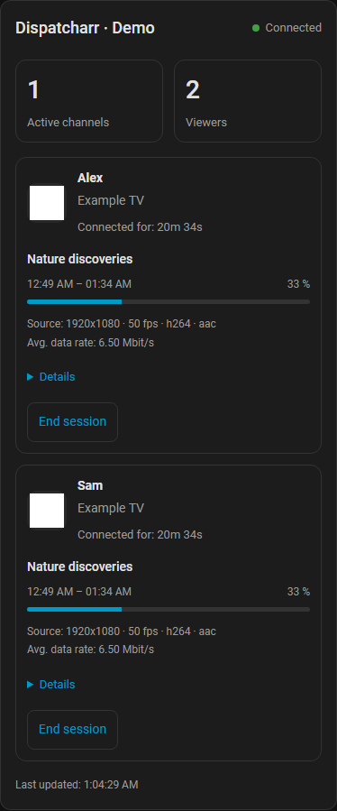

<picture>
  <source media="(prefers-color-scheme: dark)" srcset="custom_components/dispatcharr/brand/dark_logo@2x.png">
  
</picture>

# Dispatcharr for Home Assistant

**English** | [Deutsch](docs/README.de.md)

**Getting started:** [Setup with screenshots — English](docs/setup.md) ·
[Einrichtung mit Bildern — Deutsch](docs/setup.de.md)

See who is watching which channel, movie or episode. An independent Dispatcharr
integration with optional Jellyfin, Emby and Plex servers, GUI setup and one
bundled dashboard card.

**Verified with:** Home Assistant 2026.9.4 and Dispatcharr 0.31.0.
Built from scratch using official documentation and the verified Dispatcharr API.
No code was copied from existing Dispatcharr integrations for Home Assistant.
Independent community project.

**New in 0.2.0:** Jellyfin, Emby and Plex can appear alongside Dispatcharr in the
same card. Multiple instances work concurrently, including independent playback.
Read the [media-server setup and control limits](docs/media-servers.md).

**AI-assisted development:** This integration was developed with OpenAI Codex
(AI). Read the [AI transparency notice](AI_TRANSPARENCY.md) for its contribution,
tests performed and remaining validation limits.

All names, artwork, programmes and quality values in these previews are fictional
demo data. They illustrate the card, not a claim about a live server.

Mobile preview

## Features

- Connection status, last successful update, active channels and connected viewers.
- Optional Jellyfin, Emby and Plex connections with independent status, actual
  users/devices, playback progress, artwork and reported source/output quality.
- One automatically updated row per actual client session: user, optional device
  alias, channel logo, connection duration and current EPG programme.
- Programme progress, reported source resolution, frame rate, average bitrate,
  video/audio codecs and expandable provider/profile details.
- End one client session or separately confirm stopping a channel for everyone.
  Controls default to off and require a Home Assistant administrator.
- Multiple instances, GUI options and aliases, reauthentication and URL/key changes.
- English and German UI, Home Assistant themes, desktop and mobile layouts.
- No extra playback sessions, full XMLTV downloads or Dispatcharr keys in the browser.

## Install with HACS

1. Open **HACS > menu > Custom repositories**.
2. Add `https://github.com/bttfw/ha-dispatcharr`, type **Integration**.
3. Find **Dispatcharr** in HACS and download it.
4. Restart Home Assistant through **Settings > System > Restart**.
5. Open **Settings > Devices & services > Add integration > Dispatcharr**.
6. Enter the Dispatcharr URL and API key. No username or password is required.
   Use **Add service** to configure another instance.

Jellyfin, Emby and Plex credentials are entered **after** this first setup:
**Dispatcharr → Configure (gear icon) → Media servers → Add server**.
See the [illustrated walkthrough](docs/setup.md#2-open-configure).

Available as a HACS custom repository. The [default-catalog submission](https://github.com/hacs/default/pull/11610)
was reopened on 6 October 2026 for v0.2.0 and is awaiting HACS review. It has not
yet been accepted into the default catalog; use the custom-repository steps above
in the meantime. Follow the linked pull request for its status and maintainer feedback.
The integration includes the card, so a second repository is unnecessary.

For manual installation, extract the release ZIP so that
`config/custom_components/dispatcharr/manifest.json` exists. Restart HA and
continue from step 5. No YAML configuration is required.

Future updates do not need another catalog submission. Published GitHub releases
appear as HACS updates; install the update in HA, restart HA and refresh the browser.

## API key and permissions

For Dispatcharr 0.31.0, use an **administrator account (level 10)**. Its user
form provides **Generate API Key**, or an existing **API Key**. You do not need
to regenerate an existing key; regeneration can invalidate the previous key.

Even the viewer status API requires admin permissions in this Dispatcharr
version. The HA control switch prevents this integration from sending stop
actions; it does not reduce the underlying Dispatcharr key's permissions.

Setup validates connectivity, authentication, status, metadata and current-EPG
endpoints. It checks stop-endpoint permissions using `OPTIONS`, without starting
or stopping any stream. Dispatcharr must be reachable from the HA server;
browser access alone is insufficient. HTTPS certificates are validated.

## Dashboard without YAML

1. Open an editable dashboard and choose **Edit dashboard > Add card**.
2. Switch to **By card**, search for **Dispatcharr**, and select its community card.
3. In the visual editor, select the instance's **Viewer sensor**.
4. Optionally adjust the title, **Card language**, compact mode and action-button visibility.
5. Save. If the card is missing from the card picker immediately after initial
   setup, fully reload the browser page.

The integration registers and updates its dashboard resource automatically. There
is no manual JavaScript resource configuration. After installation or an update,
reload an already open browser/app view once. Summary sensors and the control switch also
work with standard HA cards such as Tile and Entities.

The [dashboard walkthrough with screenshots](docs/setup.md#4-add-the-dashboard-card)
shows the **By card** tab and the visual editor.

## Choose a language

The setup dialogs and integration options follow your Home Assistant language.
The card also follows it by default, with English as the fallback for languages
other than German. In **Edit dashboard > Edit card > Card language**, choose
**Home Assistant language**, **English** or **Deutsch**. This affects only that
card, including its confirmations and date/number formatting, and requires no YAML.
Usernames, channel names and titles are displayed as reported by each server.

The main HACS description is English. Use **Deutsch** above for the German guide;
HACS does not provide a separate README language selector.

## Configure and operate

Open **Settings > Devices & services > Dispatcharr > instance > Configure**:

| Section | Purpose |
| --- | --- |
| Controls | Enable controls; off by default |
| Device aliases | Select an observed device and enter an alias; leave empty to remove it |
| Media servers | Add, edit or remove optional Jellyfin, Emby and Plex connections |
| Advanced | Status interval, metadata cache and current-EPG interval, in seconds |

The device page also exposes an **Enable controls** switch. To change the URL
or key, use the instance's **menu > Reconfigure** action. HA offers a
reauthentication flow when a key is rejected.

Aliases can be assigned to currently observed devices or previously saved
aliases. Dispatcharr's device identifier combines the reported IP and User-Agent; it is not a
hardware identity and can be ambiguous behind a shared proxy or after an IP
change. User accounts are matched only by Dispatcharr's actual `user_id`, never
by name or list position.

Media-server aliases use the configured source and its actual device ID. Their
user identities stay scoped to that server; names/IP addresses do not cause
cross-server merging. See the [media-server guide](docs/media-servers.md).

With controls enabled, **End session** appears on the corresponding viewer row.
Its confirmation dialog identifies the exact client ID. **Details > Stop channel
for everyone** is a separate action with an explicit warning affecting all viewers.

Every action checks current channel details first. Expired IDs produce a clear
error. An HTTP success response alone is not treated as a confirmed stop: the
integration reads the actual status again. A failed client stop never falls back
to stopping the whole channel. Some players automatically reconnect as a new session.

## What the data means

- **Viewers** counts connected client sessions, not unique people. Two devices
  belonging to one user count as two viewers.
- **Active channels** counts reported channel proxies, including a proxy that
  briefly remains active without viewers.
- Dispatcharr does not expose reliable play/pause state for the end device.
  Connection duration and channel proxy state are available; device playback
  state remains **Unknown** when no data is provided.
- Resolution, frame rate and codecs describe the reported **source**, not
  guaranteed output quality after client transcoding. **Avg. data rate** is
  Dispatcharr's average channel bitrate, converted to Mbit/s. A channel name
  containing "4K" is not a quality measurement.
- Missing logos and EPG are shown explicitly. Expired programmes disappear.
  Identities, programmes and quality values are not invented.
- Dispatcharr monitoring covers live TV through its TS proxy. Dispatcharr VOD,
  DVR and playback bypassing that proxy are not reported by this source.
  Optional media servers independently report their active playback, including
  movies and episodes; their session count is separate from Dispatcharr clients.

## Polling and privacy

Dispatcharr uses one shared asynchronous coordinator per instance. Defaults are 10 seconds
for status and 15 minutes for user/provider/profile directories and channel
metadata. Newly active channels trigger targeted metadata requests. Current
programmes are loaded every 60 seconds, only for active channel UUIDs. There are
no recurring EPG calls with no active channels. Failed auxiliary requests retry
after 60 seconds.

Optional media sources use a separate shared coordinator with concurrent session
requests and isolated failures. Artwork is fetched lazily and cached separately.

Dispatcharr truncates the overview to ten clients per channel. If the list differs
from `client_count`, full channel details are requested. A response that remains
incomplete is not presented as a complete status.

Logos pass through an authenticated HA endpoint and a bounded backend cache.
PNG, JPEG, WebP and GIF are supported. External image URLs, SVG, redirects and
API-key query parameters are not passed through to the browser.

The API key is stored in HA configuration data and sent only by the backend as
a header. Treat HA backups accordingly. Diagnostics contain versions, intervals
and counts, without credentials, usernames, IP addresses or session IDs.
Transient viewer attributes are excluded from Recorder. HA users who can access
the entities can see current viewer data; only administrators can execute stop
actions. There is no additional per-viewer visibility policy.

## Troubleshooting

| Message | Check |
| --- | --- |
| API key rejected | Enter a valid key through the HA authentication dialog |
| Missing permissions | Dispatcharr admin rights and network permissions |
| Connection lost | Reachability from HA, URL, reverse proxy and TLS |
| Unknown metadata | Channel mappings in Dispatcharr; auxiliary requests will retry |
| No channel logo in the card | Logo configuration in Dispatcharr and a supported raster format |
| HACS shows "icon not available" | [Known HACS 2.0.5 branding issue](docs/setup.md#why-is-the-logo-missing-in-hacs); reinstalling this integration does not fix it |
| Stop not confirmed | Actual session status; the player may have reconnected |

Download diagnostics from the integration and open an
[issue](https://github.com/bttfw/ha-dispatcharr/issues) with your versions.
Do not publish API keys, raw account API responses or stream URLs.

## Development and evidence

- [Architecture and verified API contract](docs/architecture.md)
- [Test and live-check report](docs/validation.md)
- [AI transparency notice](AI_TRANSPARENCY.md)
- [Changelog](CHANGELOG.md)
- [GitHub checks](https://github.com/bttfw/ha-dispatcharr/actions)

Dependabot checks Python test dependencies and versioned GitHub Actions every
Monday morning (Europe/Berlin), opening update PRs against `beta`. Minor and patch
Python updates are grouped; major updates remain separate. Security alerts and
security update PRs are enabled; GitHub directs security fixes to `main`.
All updates require review and passing checks, with no automatic merge or release.
See the [configuration](.github/dependabot.yml) for scope and schedule.

84 automated tests passed against HA 2026.9.4, along with hassfest, HACS and code
checks. Browser tests cover synthetic multi-viewer scenarios, exact-client and
whole-channel stops, outages, missing data, aliases and visual configuration.
Production installation through HACS, empty and active live dashboards, actual
user-ID mapping and reported programme/source fields were also verified.
The repository owner also confirmed successfully ending one real IPTV client session.
Automated stop tests use synthetic sessions. Isolated media-server tests also
used owned video material and confirmed exact Jellyfin targeting. The tested
Emby client ignored its stop command; Plex termination was denied and ambiguous
native IDs disable the action. See the validation report for the
scope and source of each check; no independent human code review is claimed.

The bundled logo is an original community-integration mark, not an official
Dispatcharr or Home Assistant endorsement. See [HACS catalog submission](docs/hacs-submission.md)
for the requirements and current submission status.
