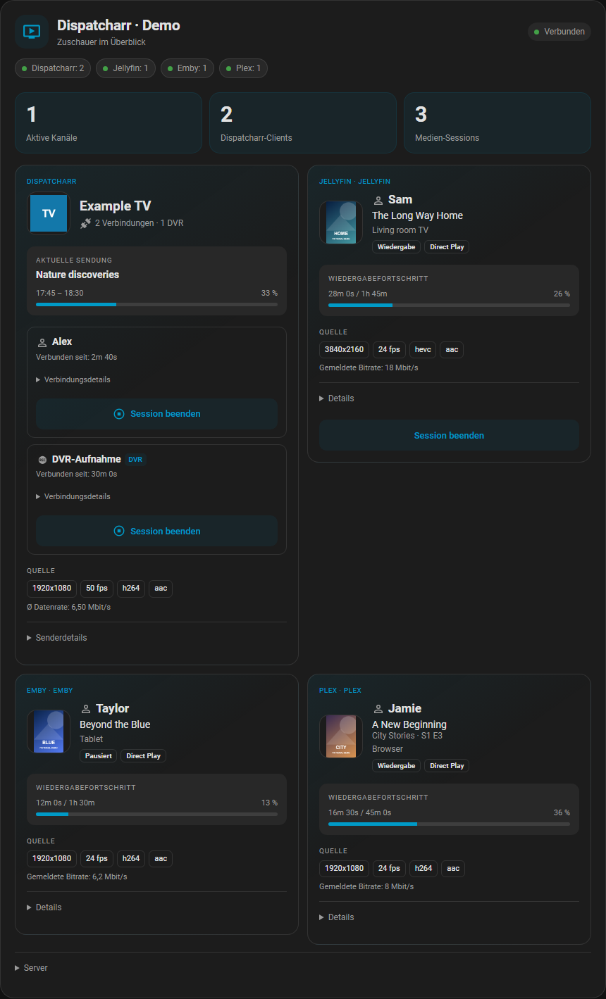
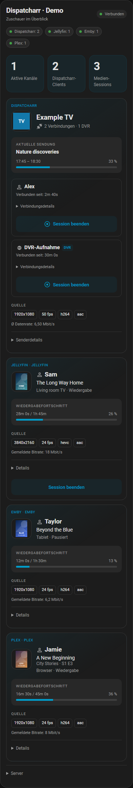

# Dispatcharr für Home Assistant

**Neu in 0.2.0:** Jellyfin, Emby und Plex lassen sich gemeinsam mit Dispatcharr
anzeigen, auch bei unabhängigen Wiedergaben und mehreren Servern desselben Typs.
Siehe [Medienserver-Einrichtung und bekannte Grenzen](media-servers.de.md).

[English](../README.md) | **Deutsch**

**Schritt für Schritt mit Bildern:** [Deutsche Anleitung](setup.de.md) ·
[English guide](setup.md)

Wer schaut gerade welchen Sender, Film oder welche Folge? Eine eigenständige
Dispatcharr-Integration mit optionalen Jellyfin-, Emby- und Plex-Verbindungen,
GUI-Einrichtung und einer gemeinsamen Dashboard-Karte.

**Geprüfte Basis:** Home Assistant 2026.9.4, Dispatcharr 0.31.0.
Vollständig neu implementiert, ohne Code aus anderen Dispatcharr-Integrationen
für Home Assistant. Grundlage sind die offiziellen APIs und Entwicklerdokumentationen.
Unabhängiges Community-Projekt.

**KI-gestützte Entwicklung:** Diese Integration wurde mit OpenAI Codex entwickelt.
Die eigenständige Implementierung basiert auf offiziellen Dokumentationen und
der verifizierten Dispatcharr-API. Automatische Tests und Browserprüfungen sind
dokumentiert. Der Repository-Inhaber hat zusätzlich einen manuellen
Live-Abbruchtest bestätigt; automatisierte Stopptests verwenden synthetische Daten.
Details stehen im [Transparenzhinweis](../AI_TRANSPARENCY.md).

Namen, Bilder, Sendungen und Qualitätswerte dieser Vorschau sind frei erfundene
Beispieldaten. Sie veranschaulichen die Karte und zeigen keinen echten Server.

Smartphone-Vorschau

## Funktionen

- Erreichbarkeit, letzte erfolgreiche Aktualisierung, aktive Kanäle und Zuschauer.
- Optionale Jellyfin-, Emby- und Plex-Server mit getrenntem Status, tatsächlichen
  Benutzern/Geräten, Wiedergabefortschritt, Bildern und Quell-/Ausgabequalität.
- Eine automatisch aktualisierte Zeile je tatsächlicher Client-Session: Benutzer,
  optionaler Geräte-Alias, Senderlogo, Verbindungsdauer und aktuelles EPG.
- Sendungsfortschritt, gemeldete Quellauflösung, Bildrate, mittlere Datenrate,
  Video-/Audiocodec sowie aufklappbare Provider- und Profilinformationen.
- Einzelne Sessions beenden; gesamten Kanal als getrennte Aktion mit Bestätigung
  beenden. Steuerung standardmäßig aus und auf HA-Administratoren beschränkt.
- Mehrere Instanzen, GUI-Optionen, GUI-Aliase, Reauthentifizierung und URL-/Key-Wechsel.
- Deutsche und englische Oberfläche, HA-Themes, Desktop und Smartphone.
- Keine zusätzlichen Wiedergaben, keine XMLTV-Komplettabfrage, keine Keys im Browser.

## Sprache auswählen

Einrichtung und Integrationsoptionen folgen der Sprache von Home Assistant.
Die Karte übernimmt diese ebenfalls automatisch; für andere Sprachen als Deutsch
wird Englisch verwendet. Unter **Dashboard bearbeiten → Karte bearbeiten →
Kartensprache** lassen sich **Home-Assistant-Sprache**, **English** oder **Deutsch**
auswählen. Die Auswahl gilt nur für diese Karte, einschließlich Bestätigungen und
Datums-/Zahlenformaten. YAML ist nicht erforderlich. Benutzer-, Sender- und
Sendungsnamen werden unverändert vom jeweiligen Server übernommen.

Die Hauptbeschreibung in HACS ist Englisch. Über **Deutsch** gelangt man zu
dieser Anleitung; HACS bietet keine eigene Sprachauswahl für die README.

## Installation mit HACS

1. **HACS → Menü ⋮ → Benutzerdefinierte Repositories** öffnen.
2. `https://github.com/bttfw/ha-dispatcharr` hinzufügen, Typ **Integration**.
3. In HACS nach **Dispatcharr** suchen und herunterladen.
4. Home Assistant über **Einstellungen → System → Neu starten** neu starten.
5. **Einstellungen → Geräte & Dienste → Integration hinzufügen → Dispatcharr**.
6. Dispatcharr-URL und API-Key eingeben. Benutzername und Passwort werden nicht
   verlangt. Für eine zweite Instanz „Dienst hinzufügen“ verwenden.

Die Keys für Jellyfin, Emby und Plex kommen **nach** dieser ersten Einrichtung
unter **Dispatcharr → Konfigurieren (Zahnrad) → Medienserver → Server hinzufügen**
hinein. Die [bebilderte Anleitung](setup.de.md#2-konfigurieren-öffnen) zeigt den Weg.

Als benutzerdefiniertes HACS-Repository installierbar. Der
[Aufnahmeantrag für den Standardkatalog](https://github.com/hacs/default/pull/11610)
wurde vorerst zurückgezogen, während weitere Verbesserungen entwickelt werden.
Die Karte wird von der Integration mitgeladen, ohne zweites Repository.

Künftige Updates brauchen keinen neuen Aufnahmeantrag. Neue GitHub-Releases
erscheinen als HACS-Update. Update in HA installieren, HA neu starten und den
Browser neu laden.

Manuell: Das Release-ZIP so entpacken, dass
`config/custom_components/dispatcharr/manifest.json` existiert; anschließend
HA neu starten und die Schritte ab 5 ausführen. Keine YAML-Konfiguration nötig.

## API-Key und Berechtigungen

In Dispatcharr 0.31.0 einen Benutzer mit **Admin-Rechten (Stufe 10)** verwenden.
Im Benutzerformular gibt es **Generate API Key** beziehungsweise einen bereits
vorhandenen **API Key**. Ein bestehender Key muss nicht neu erzeugt werden.
Regenerieren widerruft gegebenenfalls den bisher verwendeten Key.

Auch die lesende Zuschauer-Statusabfrage benötigt in dieser Dispatcharr-Version
Admin-Rechte. Der HA-Schalter verhindert Schreibaktionen innerhalb dieser
Integration; er ändert nicht die Berechtigungen des Dispatcharr-Keys.

Die Einrichtung prüft Verbindung, Anmeldung, Status-, Metadaten- und EPG-API
sowie die Rechte der Stoppendpunkte mittels `OPTIONS`. Dabei wird kein Stream
gestartet oder beendet. Dispatcharr muss von Home Assistant aus erreichbar sein;
ein Browser-Zugriff allein reicht nicht. HTTPS-Zertifikate werden validiert.

## Dashboard ohne YAML

1. Ein bearbeitbares Dashboard öffnen, **Dashboard bearbeiten → Karte hinzufügen**.
2. Auf **Nach Karte** wechseln, **Dispatcharr** suchen und die Community-Karte auswählen.
3. Im visuellen Editor den **Zuschauer-Sensor** der gewünschten Instanz auswählen.
4. Optional Titel, kompakte Ansicht und sichtbare Aktionsschaltflächen einstellen.
5. Speichern. Falls die Karte nach der erstmaligen Einrichtung noch nicht im
   Kartenkatalog erscheint, die Browserseite vollständig neu laden.

Die Karte wird automatisch als Dashboard-Ressource registriert und bei Updates
aktualisiert. Kein manuelles Eintragen von JavaScript-Ressourcen erforderlich.
Nach Installation oder Update eine bereits geöffnete Browser-/App-Ansicht einmal
neu laden. Die normalen Sensoren und der
Konfigurationsschalter lassen sich zusätzlich über HA-Standardkarten wie
„Kachel“ oder „Entitäten“ auswählen.

Die [Dashboard-Anleitung mit Bildern](setup.de.md#4-dashboard-karte-hinzufügen)
zeigt die Registerkarte **Nach Karte** und den visuellen Editor.

## Konfigurieren und bedienen

**Einstellungen → Geräte & Dienste → Dispatcharr → gewünschte Instanz → Konfigurieren**:

| Bereich | Funktion |
| --- | --- |
| Steuerung | „Steuerung aktivieren“, standardmäßig aus |
| Geräte-Aliase | Beobachtetes Gerät auswählen und Alias eingeben; leer entfernt ihn |
| Medienserver | Optionale Jellyfin-, Emby- und Plex-Verbindungen hinzufügen, ändern oder entfernen |
| Erweitert | Statusintervall, Metadaten-Cache und EPG-Intervall in Sekunden |

Zusätzlich gibt es auf der Geräteseite die Schalter-Entität **Steuerung aktivieren**.
Für URL-/Key-Wechsel das **⋮-Menü der Instanz → Neu konfigurieren** verwenden.
Bei einem abgewiesenen Key bietet HA die erneute Authentifizierung an.

Die Alias-Auswahl umfasst aktuell beobachtete Geräte und bereits gespeicherte
Aliase. Bei Dispatcharr basiert ein Alias auf gemeldeter IP und User-Agent.
Das ist keine sichere Hardware-ID: Bei gemeinsamem Proxy oder geänderter IP
kann die Zuordnung uneindeutig werden. Die eigentliche Benutzerzuordnung nutzt
ausschließlich Dispatcharrs `user_id`, niemals Namen oder Listenpositionen.

Bei Medienservern verwenden Aliase die konfigurierte Quelle und deren tatsächliche
Geräte-ID. Benutzer bleiben dem jeweiligen Server zugeordnet; Namen und IPs
führen nicht zu einer Zusammenlegung. Details stehen in der
[Medienserver-Anleitung](media-servers.de.md).

Bei aktiver Steuerung erscheint **Session beenden** an der betreffenden Zeile.
Der Dialog nennt die konkrete Client-ID. Die Aktion betrifft nur diese Session.
Unter **Details → Kanal für alle beenden** befindet sich die getrennte
Kanalaktion mit ausdrücklicher Bestätigung für alle Zuschauer.

Vor jeder Aktion wird der aktuelle Kanalstatus geprüft. Abgelaufene IDs erzeugen
eine verständliche Meldung. Ein erfolgreicher HTTP-Aufruf gilt nicht automatisch
als erfolgreicher Stopp: Die Integration fragt den tatsächlichen Status erneut
ab. Ein Clientstopp wird niemals durch einen Kanalstopp ersetzt. Manche Player
verbinden sich selbstständig erneut; das ist dann eine neue Client-Session.

## Was die Anzeige tatsächlich aussagt

- **Zuschauer** zählt verbundene Client-Sessions, nicht eindeutige Personen.
  Zwei Geräte desselben Benutzers sind zwei Zuschauer.
- **Aktive Kanäle** zählt gemeldete Kanal-Proxys, auch einen kurzfristig noch
  laufenden Kanal ohne Zuschauer.
- Dispatcharr meldet keinen verlässlichen Play-/Pause-Zustand des Endgeräts.
  Die Karte zeigt die Verbindungsdauer und unter „Details“ den Kanal-Proxy;
  der Wiedergabestatus des Geräts bleibt ohne Daten **Unbekannt**.
- Auflösung, Bildrate und Codecs beschreiben die gemeldete **Quelle**, nicht die
  Ausgabequalität nach Client-Transcoding. „Ø Datenrate“ ist Dispatcharrs mittlere
  Kanal-Datenrate, umgerechnet in Mbit/s. „4K“ im Namen ist kein Messwert.
- Fehlende EPG-Daten und Logos werden ausdrücklich angezeigt. Abgelaufene
  Sendungen verschwinden. Keine Sendungen oder Identitäten werden erfunden.
- Die Dispatcharr-Quelle unterstützt Live-TV-Sessions der TS-Proxy-API. Sie meldet
  kein Dispatcharr-VOD/DVR und keine Wiedergaben, die diesen Proxy umgehen.
  Optionale Medienserver melden ihre eigenen aktiven Wiedergaben einschließlich
  Filmen und Folgen; ihr Session-Zähler bleibt getrennt von Dispatcharr-Clients.

## Abfragen und Datenschutz

Für Dispatcharr gibt es pro Instanz einen gemeinsamen asynchronen Coordinator.
Standardmäßig Status alle
10 Sekunden, Benutzer/Provider/Profile und Kanalmetadaten alle 15 Minuten;
neue aktive Kanäle werden gezielt ergänzt. Aktuelle Sendungen werden alle
60 Sekunden ausschließlich für aktive Kanal-UUIDs geladen. Bei null aktiven
Kanälen gibt es keine laufenden EPG-Abfragen. Fehlgeschlagene Zusatzabfragen
werden nach 60 Sekunden erneut versucht.

Optionale Medienserver nutzen einen weiteren gemeinsamen Coordinator mit
gleichzeitigen Abfragen und getrennten Fehlerzuständen. Bilder werden bei Bedarf
geladen und separat gecacht.

Dispatcharr kürzt die Übersicht auf zehn Clients pro Kanal. Bei Abweichungen
zu `client_count` werden vollständige Details abgefragt. Eine weiterhin
unvollständige Antwort wird nicht als vollständiger Status ausgegeben.

Logos werden über einen authentifizierten HA-Endpunkt geladen und im Backend
begrenzt gecacht. Unterstützt: PNG, JPEG, WebP und GIF. Externe Bild-URLs, SVG,
Weiterleitungen und API-Key-Parameter werden nicht durchgereicht.

Der API-Key liegt nur in HA-Konfigurationsdaten und wird ausschließlich im
Backend als Header verwendet. HA-Backups entsprechend vertraulich behandeln.
Diagnosen enthalten Versionen, Intervalle und Zähler, keine Zugangsdaten,
Benutzernamen, IPs oder Session-IDs. Transiente Zuschauerattribute sind vom
Recorder ausgeschlossen. Angemeldete HA-Benutzer mit Zugriff auf die Entitäten
können die aktuellen Zuschauerinformationen sehen; nur Administratoren können
Stoppaktionen auslösen. Keine zusätzliche individuelle Sichtbarkeitsverwaltung.

## Fehlerbehebung

| Anzeige | Vorgehen |
| --- | --- |
| API-Key abgewiesen | Über den HA-Dialog einen gültigen Key hinterlegen |
| Fehlende Berechtigungen | Dispatcharr-Admin und Netzwerkfreigaben prüfen |
| Verbindung unterbrochen | Erreichbarkeit aus HA, URL, Reverse Proxy und TLS prüfen |
| Unbekannte Metadaten | Dispatcharr-Zuordnung prüfen; Zusatzdaten werden erneut geladen |
| Kein Senderlogo in der Karte | Logo in Dispatcharr und unterstütztes Rasterformat prüfen |
| HACS zeigt „icon not available“ | [Bekannter HACS-2.0.5-Anzeigefehler](setup.de.md#warum-fehlt-das-logo-in-hacs); Neuinstallation dieser Integration hilft hier nicht |
| Stopp nicht bestätigt | Tatsächlichen Status prüfen; der Player kann erneut verbinden |

Bei Problemen über die Integration **Diagnosedaten herunterladen** und ein
[Issue](https://github.com/bttfw/ha-dispatcharr/issues) mit den Versionen erstellen.
Keine API-Keys, Rohantworten der Benutzer-API oder Stream-URLs veröffentlichen.

## Entwicklung und Nachweise

- [Architektur und verifizierter API-Vertrag](architecture.md)
- [Test- und Live-Prüfbericht](validation.md)
- [Changelog](../CHANGELOG.md)
- [GitHub-Prüfungen](https://github.com/bttfw/ha-dispatcharr/actions)

Automatische Tests verwenden synthetische API-Daten. Der Repository-Inhaber
hat am 6. Oktober 2026 das erfolgreiche Beenden einer einzelnen echten IPTV-Session bestätigt.
Das ist eine Funktionsprüfung durch den Inhaber; eine unabhängige menschliche
Codeprüfung wird damit nicht behauptet. Den genauen Testumfang dokumentiert
der Prüfbericht.
