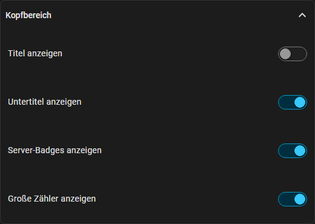
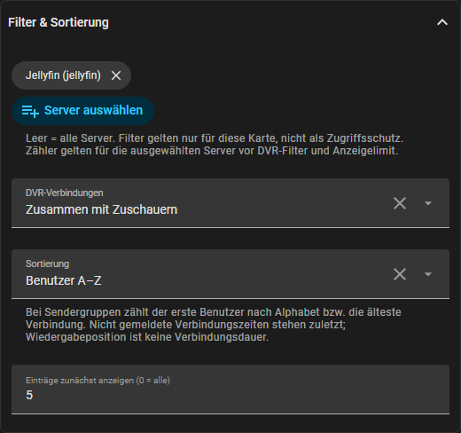
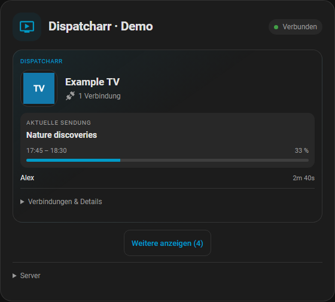
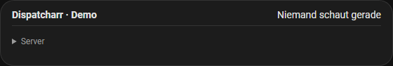

# Karten anpassen und Verbindungen prüfen

[English](card-customization.md) · [Vorhandene Ansichten](card-layouts.md)

Ab **0.4.0** gehören diese Optionen zum regulären Release. Bestehende Karten
behalten ihre Einstellungen. In **HACS → Dispatcharr** auf **v0.4.0** aktualisieren,
HA neu starten und Browser/App neu laden. Von der Beta: bei Bedarf
**Erneut herunterladen → Benötigst du eine andere Version? → v0.4.0** wählen.
Eine erneute Einrichtung der Integration ist nicht nötig.

## Visueller Karteneditor

**Dashboard bearbeiten → Dispatcharr-Karte bearbeiten**. Alle Optionen funktionieren
mit Raster, kompakter Liste und Logo-Kacheln und sind deutsch/englisch verfügbar.

| Bereich | Einstellung | Wirkung |
| --- | --- | --- |
| Hauptbereich | Wiedergabe-Badges | Gemeldeter Status und Wiedergabeart des Medienservers; keine Schätzungen. |
| Hauptbereich | Schmale Ansicht, wenn niemand schaut | Bei Inaktivität eine Statuszeile und aufklappbare Serverdetails. Wiedergaben klappen die Karte auf; Fehler bleiben sichtbar. |
| Kopfbereich | Titel, Untertitel, Server-Badges, große Zähler | Jedes Element unabhängig ausblenden. |
| Filter & Sortierung | Server auswählen | Tatsächliche Server einzeln auswählen; leer bedeutet alle. Auch zwei Jellyfin-Server bleiben getrennt auswählbar. |
| Filter & Sortierung | DVR-Verbindungen | Zusammen anzeigen, ausblenden, nur Aufnahmen oder Aufnahmen separat. Grundlage ist die gemeldete Dispatcharr-DVR-Kennung. |
| Filter & Sortierung | Sortierung | Server-Reihenfolge, Benutzer A–Z, Sender/Titel A–Z oder längste Verbindung zuerst. |
| Filter & Sortierung | Einträge zunächst anzeigen | 0 zeigt alle. „Weitere anzeigen“ ergänzt die eingestellte Anzahl, „Weniger anzeigen“ setzt zurück. Eine Sendergruppe zählt als ein Eintrag. |

Zähler gelten für **ausgewählte Server vor DVR-Filter und Anzeigelimit**. Filter
verändern nur die Karte und sind kein Zugriffsschutz. Ein entfernter, weiterhin
ausgewählter Server erzeugt einen Hinweis.

Bei Sendergruppen zählt der alphabetisch erste angezeigte Benutzer bzw. die
älteste gemeldete Verbindung. Unbekannte Verbindungszeiten stehen zuletzt;
Wiedergabeposition ist keine Verbindungsdauer. Namen, Titel oder IP-Adressen
führen nicht zum Zusammenfassen unabhängiger Sessions.

„Kanal für alle beenden“ betrifft weiterhin alle Verbindungen, auch ausgeblendete
Aufnahmen. Die Bestätigung weist darauf hin. Einzelne Sessions werden weiterhin
über tatsächliche IDs und mit den bestehenden Backend-Berechtigungen beendet.

## Verbindung prüfen

**Einstellungen → Geräte & Dienste → Dispatcharr → Konfigurieren → Verbindung prüfen**.
Dispatcharr oder einen optionalen Medienserver wählen. Das Ergebnis zeigt
Erreichbarkeit, Anmeldung und Session-Zugriff. Dispatcharr prüft zusätzlich
Metadaten-/EPG-Endpunkte mit leeren Kanallisten und Steuerrechte per `OPTIONS`.

✓ bedeutet erfolgreich, ✗ fehlgeschlagen, — nicht geprüft. Ein erreichbarer Server
kann trotzdem den Schlüssel ablehnen. Meldungen unterscheiden Timeout, DNS,
abgelehnte Verbindung und Zertifikatsprobleme. Medienserver-Stop-Funktionen werden
nicht getestet. Keine Wiedergaben werden gestartet/beendet und keine Einstellungen
geändert. OK führt ohne Integrations-Reload zurück zum Menü.

## Hinweise zum Update

Alle drei Ansichten unterstützen diese Optionen. Bestehende Entity-IDs,
Medienserver, Aliase, Steuerungsschalter und Karteneinstellungen bleiben erhalten.
Eine während des Betatests angelegte Vergleichsseite kann über den
Dashboard-Editor entfernt werden; sie wird von der Integration nicht benötigt.

Öffentliche Bilder zeigen erfundene Demodaten. Live-Karten erfinden keine Zuschauer.
Abbruchtests nur mit einer ausdrücklich freigegebenen Testsession durchführen.
