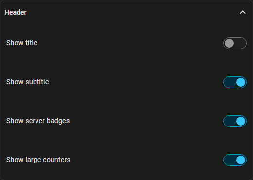
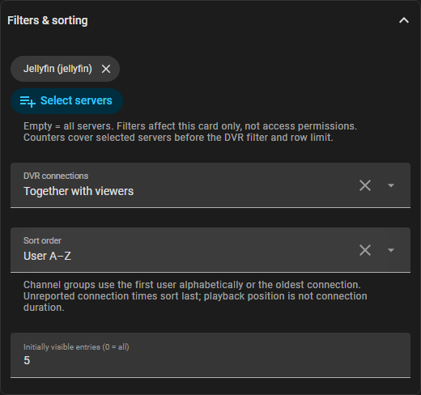
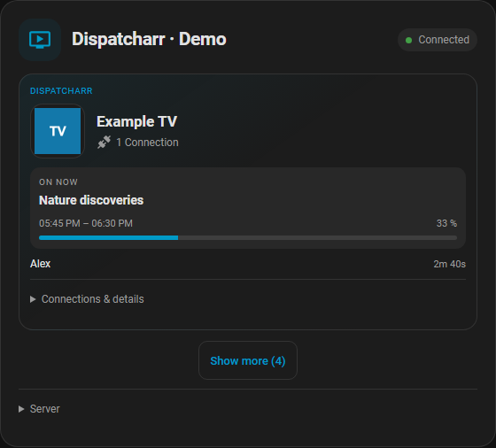
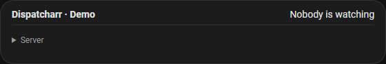

# Customize cards and check connections

[Deutsch](card-customization.de.md) · [Existing layouts](card-layouts.md)

These options are included in the regular release from **0.4.0**. Existing
cards retain their settings. Update to **v0.4.0** in **HACS → Dispatcharr**,
restart HA and reload the browser/app. From the beta, use **Redownload →
Need a different version? → v0.4.0** if needed. No integration setup is required.

## Visual card editor

Open **Edit dashboard → Edit card**. All options work with Grid, Compact list
and Logo tiles and are available in English and German.

| Location | Option | Behavior |
| --- | --- | --- |
| Main editor | Show playback badges | Reported media state and play method; no inferred values. |
| Main editor | Slim view when nobody is watching | A short idle line with expandable server status. Playback expands it automatically; outages remain visible. |
| Header | Title, subtitle, server badges, large counters | Independently hide each element. Connection errors remain visible. |
| Filters & sorting | Select servers | Select actual configured servers; empty means all. Two Jellyfin servers can be selected separately. |
| Filters & sorting | DVR connections | Show together, hide, recordings only, or separate recordings below other entries. Uses the DVR identity reported by Dispatcharr. |
| Filters & sorting | Sort order | Server order, user A–Z, channel/title A–Z, longest connection first. |
| Filters & sorting | Initially visible entries | 0 shows all; Show more adds the configured number and Show less resets it. A channel group counts as one entry. |

Counters cover **selected servers before DVR filtering and the row limit**.
Filters are presentation only, not access control. A removed selected server
produces a warning instead of silently switching to all sources.

Channel groups sort by their first displayed identity alphabetically or oldest
reported connection start. Media sessions without a connection start sort last
for duration. Playback position does not prove connection age. Names, titles
and IP addresses never merge independent sessions.

Hiding recordings does not change whole-channel stop scope: its confirmation
still warns about every client, including hidden DVR connections. Individual
actions continue to use the exact client/session ID and backend permissions.

## Check connection

Open **Settings → Devices & services → Dispatcharr → Configure → Check connection**.
Choose Dispatcharr or an optional media server. Results show reachability,
authentication and session access. Dispatcharr additionally checks metadata/EPG
with empty channel lists and control permissions using `OPTIONS` only.

✓ means passed, ✗ failed, and — not checked. A reachable server may still reject
a key or deny permissions. Messages distinguish timeout, DNS, refused connections
and TLS validation. Media stop capabilities are not tested or claimed. No playback
is started/stopped, no settings change, and returning to the menu causes no reload.

## Upgrade notes

All three layouts support these options. Existing entity IDs, media servers,
aliases, control switches and card settings remain unchanged. A comparison view
created during beta testing can be removed through the dashboard editor; the
integration does not require it.

Public previews contain fictional data. Live dashboards never fabricate viewers.
Only test termination with an explicitly authorized test session.
