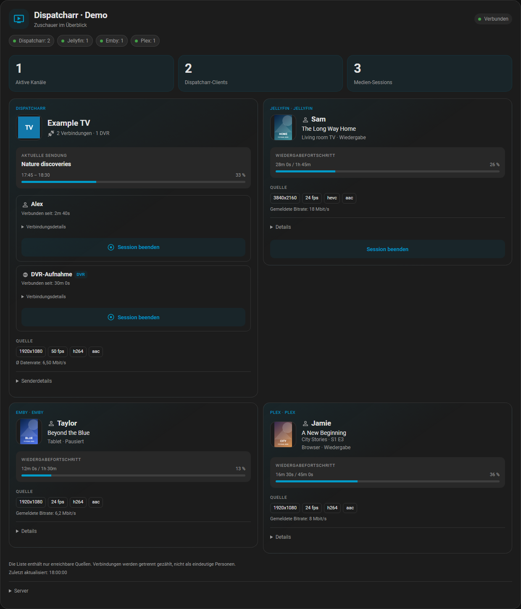
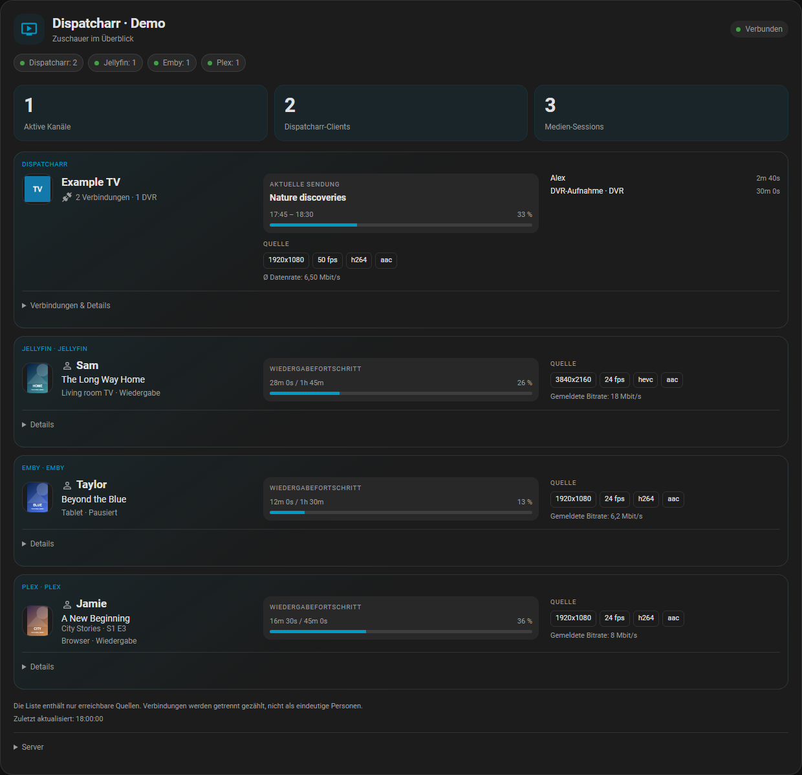
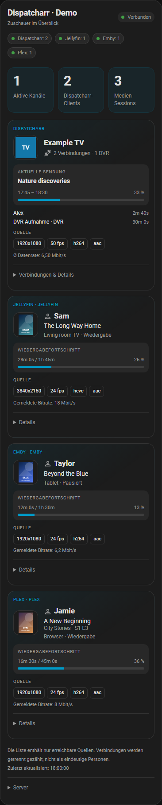
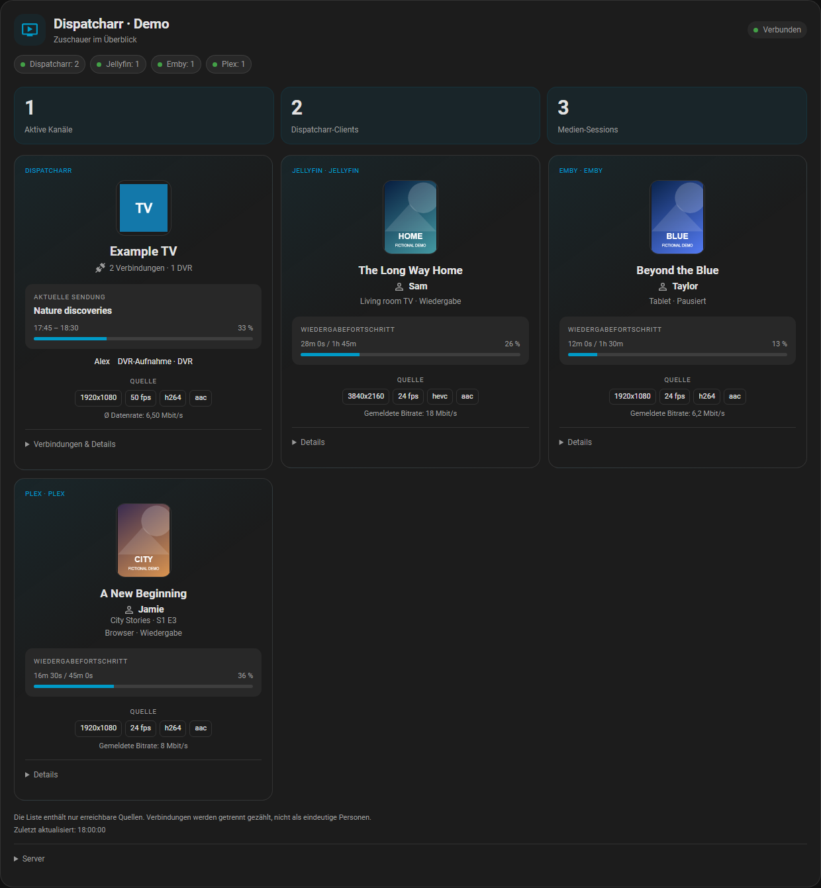
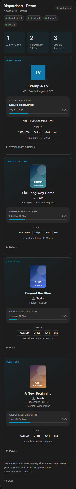

# Kartenansicht auswählen

[English](card-layouts.md) | **Deutsch** · [Einrichtungsanleitung](setup.de.md)

Ab **0.3.0** bietet jede Karte **Raster**, **Kompakte Liste** und **Logo-Kacheln**.
Unter **Dashboard bearbeiten → Karte bearbeiten → Ansicht** auswählen und
**Speichern**. Nach dem HACS-Update Home Assistant neu starten und das Dashboard
neu laden. Bestehende Karten behalten die Rasteransicht. YAML ist nicht nötig.

| Einstellung | Wirkung |
| --- | --- |
| Ansicht | Raster, Kompakte Liste oder Logo-Kacheln |
| Maximale Spaltenzahl | Automatisch, 1, 2 oder 3; für Raster und Kacheln verfügbar |
| Kompakte Abstände | Verringert Innenabstände und Zwischenräume |
| Quellqualität anzeigen | Blendet Auflösung, Bildrate, Codecs und Datenrate ein oder aus |
| EPG / Wiedergabefortschritt anzeigen | Blendet das Feld mit Sendung beziehungsweise Wiedergabefortschritt ein oder aus |
| Aktionsschaltflächen anzeigen | Steuert die Sichtbarkeit; Serverrechte und der Steuerungsschalter der Integration gelten weiterhin |

Die Spaltenzahl ist eine **Obergrenze**. Schmale Karten verwenden eine Spalte,
breitere Karten können zwei oder drei verwenden. Die Liste bleibt einspaltig.
Die Gesamtbreite stellst du im HA-Dashboard ein: Drei gewählte Spalten machen einen
schmalen Dashboard-Abschnitt nicht breiter. Ein einzelner Sender beziehungsweise
eine einzelne Session nutzt die verfügbare Breite.

Die Einstellungen gelten je Karte. Du kannst weitere Dispatcharr-Karten mit einer
anderen Ansicht hinzufügen, ohne eine weitere Integration oder Datenabfrage
einzurichten. Ältere Karten im Kompaktmodus behalten die ausgeblendete Qualität,
bis du sie ausdrücklich einschaltest.

## Raster

Logo, Sendung und Quellqualität erscheinen einmal pro Sender. Darunter bleiben
alle Dispatcharr-Verbindungen mit eigener Dauer und Steuerung sichtbar.
Medienserver-Sessions bleiben getrennt.

Raster auf dem Smartphone

## Kompakte Liste

Breite Karten zeigen Identität, Sendung und Verbindungen nebeneinander pro Zeile.
Auf dem Smartphone stehen diese Bereiche untereinander. Unter **Verbindungen &
Details** findest du die einzelnen Dispatcharr-Verbindungen und ihre Aktionen.
Aktionen für Medienserver-Sessions stehen unter **Details**.

Kompakte Liste auf dem Smartphone

## Logo-Kacheln

Größere, zentrierte Logos und Poster betonen Sender und Medientitel. Namen und
DVR-Kennzeichnungen bleiben sichtbar. **Verbindungen & Details** zeigt die
einzelnen Verbindungsdauern und Aktionen; bei Medienserver-Sessions stehen
die Aktionen unter **Details**.

Logo-Kacheln auf dem Smartphone

Alle Ansichten verwenden dieselben tatsächlichen Kanal-/Session-IDs. **Session
beenden** betrifft weiterhin genau eine Verbindung. **Senderdetails → Kanal für
alle beenden** bleibt eine getrennte Aktion mit Bestätigung. In Liste und Kacheln
zuerst **Verbindungen & Details** öffnen. Der Ansichtswechsel startet keine
Wiedergabe und ändert keine Servereinstellungen.

Alle Bilder zeigen erfundene Nutzer, Bilder, Sendungen und Messwerte im echten
HA-Frontend. Sie enthalten keine echten Zuschauerdaten oder Zugangsdaten.
