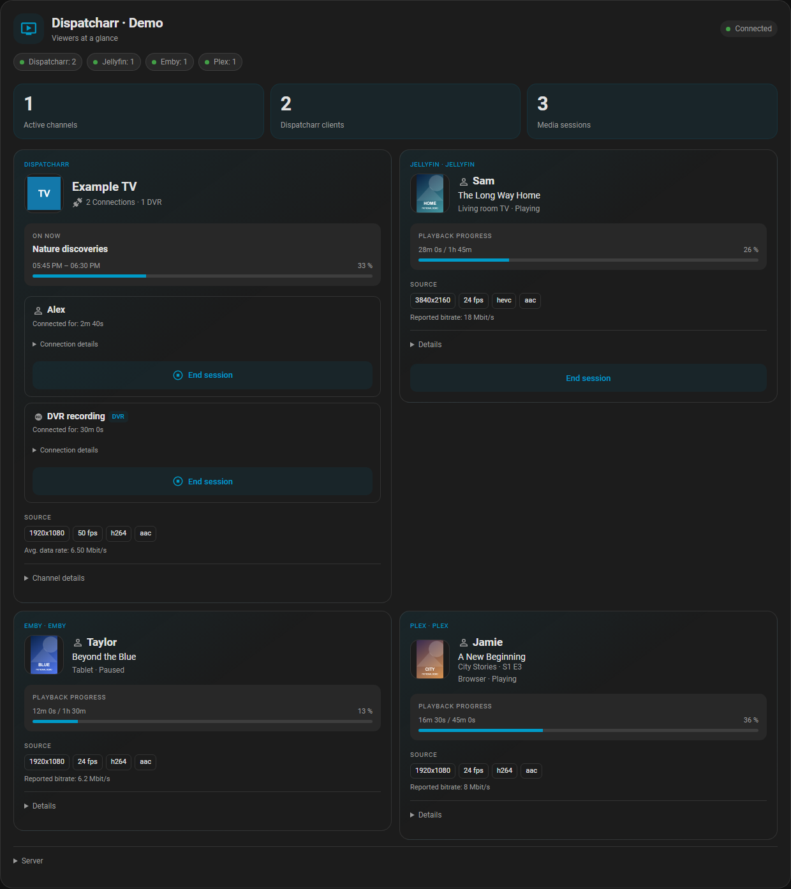
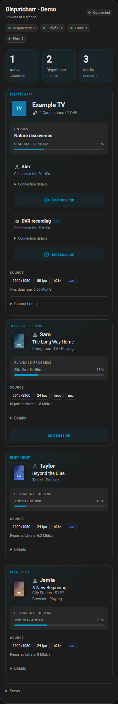
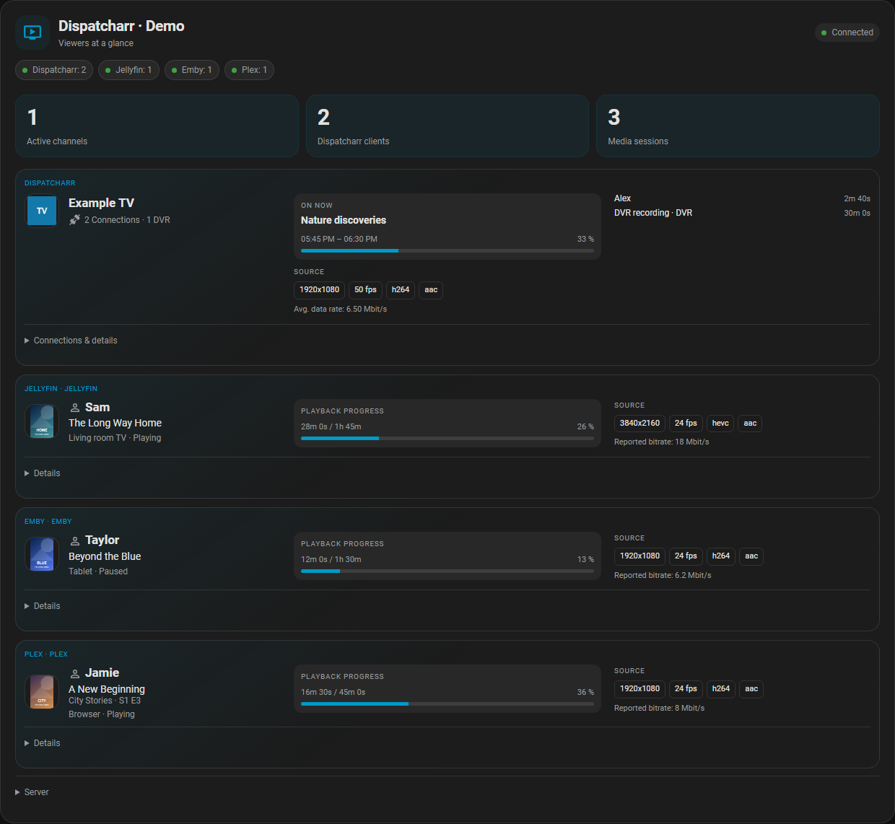
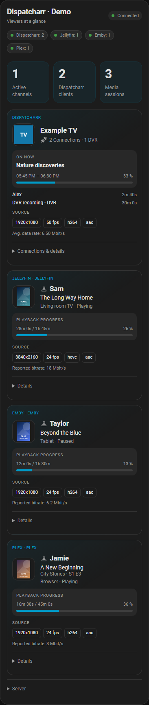
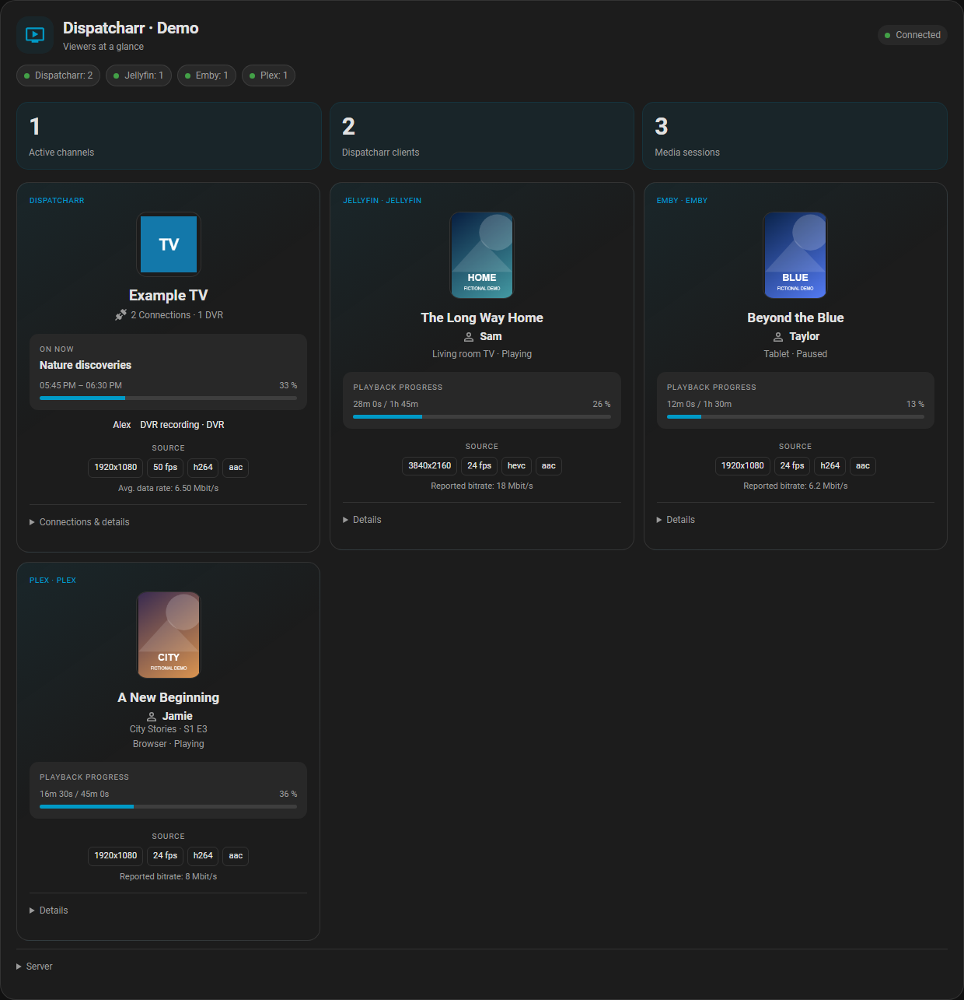
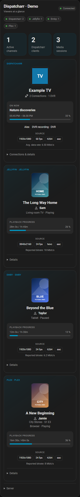
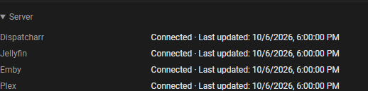

# Choose a card layout

**English** | [Deutsch](card-layouts.de.md) · [Setup guide](setup.md)

From **0.3.0**, each card offers **Grid**, **Compact list** and **Logo tiles**.
Open **Edit dashboard → Edit card → Layout**, choose an option and **Save**.
After updating through HACS, restart Home Assistant and reload the dashboard.
Existing cards keep the grid view. No YAML is needed.

| Setting | Effect |
| --- | --- |
| Layout | Grid, Compact list or Logo tiles |
| Maximum columns | Automatic, 1, 2 or 3; available for grid and tiles |
| Compact spacing | Reduces padding and gaps |
| Show source quality | Shows or hides resolution, frame rate, codecs and bitrate |
| Show EPG / playback progress | Shows or hides the programme/playback progress panel |
| Show action buttons | Controls button visibility; server permissions and the integration's control switch still apply |

Columns are a **maximum**, not a forced count. Narrow cards use one column;
wider cards can use two or three. The list always uses one column. Set the card's
overall width in the HA dashboard: selecting three columns cannot make a narrow
dashboard section wider. A single channel/session uses the available width.

These options apply to each card separately. You can add another Dispatcharr card
with a different layout without adding another integration or polling coordinator.
Older cards using compact mode keep their hidden quality panel until you enable it.

## Grid

Channel artwork, programme and source quality appear once per channel. Each
Dispatcharr connection remains visible below, with its own duration and controls.
Media-server sessions remain separate.

Grid on a phone

## Compact list

Wide cards arrange identity, programme and connections side by side in each row.
On a phone these sections stack. Open **Connections & details** for individual
Dispatcharr connection details and actions. Media-session actions are under **Details**.

Compact list on a phone

## Logo tiles

Larger centred logos and posters emphasise the channel or media title. Names and
DVR markers stay visible. Open **Connections & details** for individual connection
durations and actions; media-session actions are under **Details**.

Logo tiles on a phone

All layouts use the same actual channel/session IDs. **End session** still targets
one connection; **Channel details → Stop channel for everyone** is a separate,
confirmed action. In the list and tiles, open **Connections & details** first.
Changing layouts does not start playback or change server configuration.

## Server status

Open **Server** at the bottom of any layout to see the connection status and last
successful update for Dispatcharr and each optional media server. This also works
with Dispatcharr alone and during a disconnection. From 0.3.1, the card omits the
routine footer explanations and duplicate timestamp. Actual errors remain visible.

All screenshots show fictional users, artwork, programmes and measurements rendered
in the real Home Assistant frontend. They contain no real viewer data or credentials.
