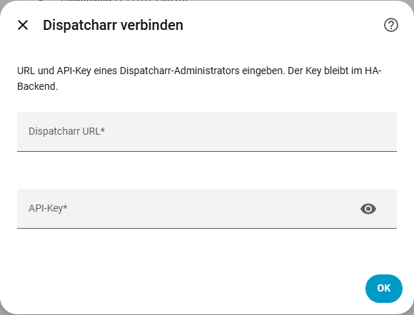
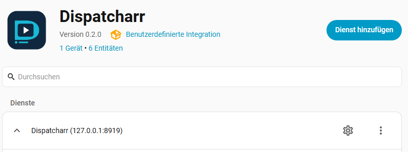
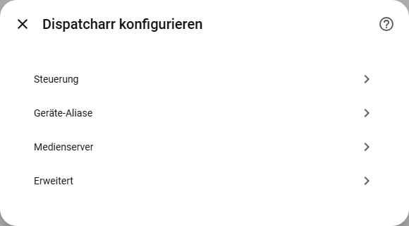
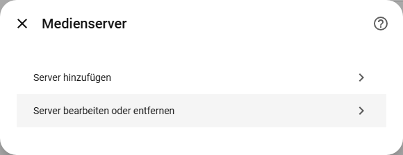
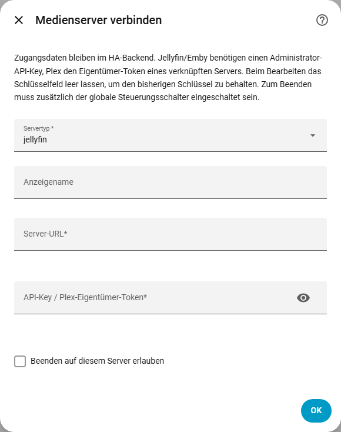
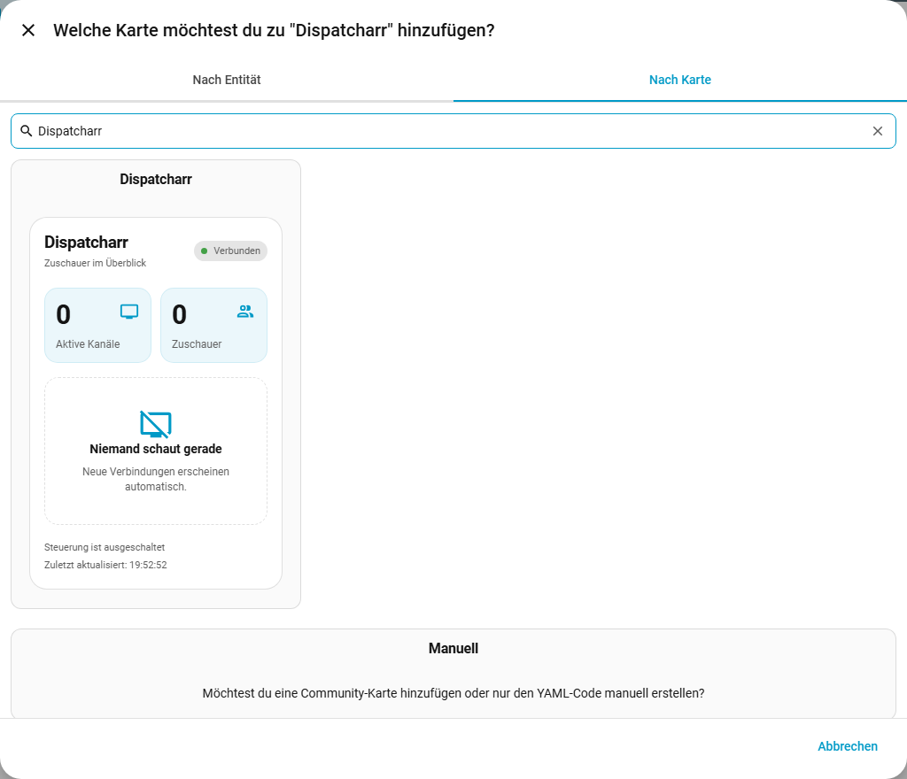
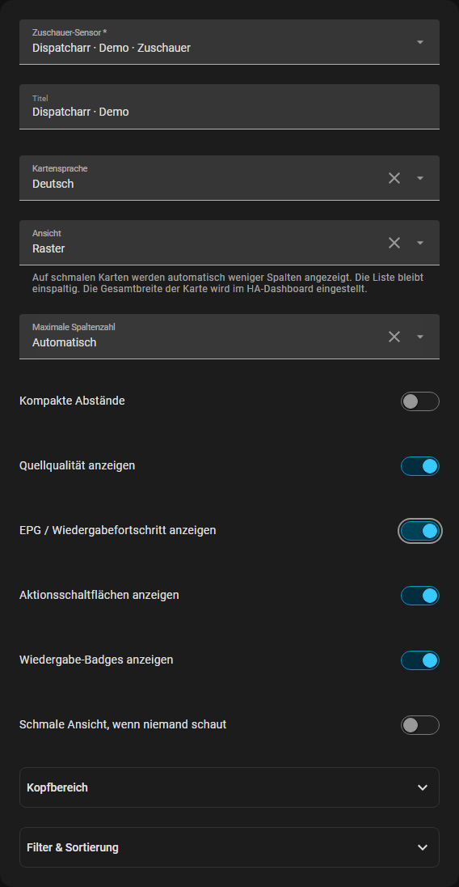
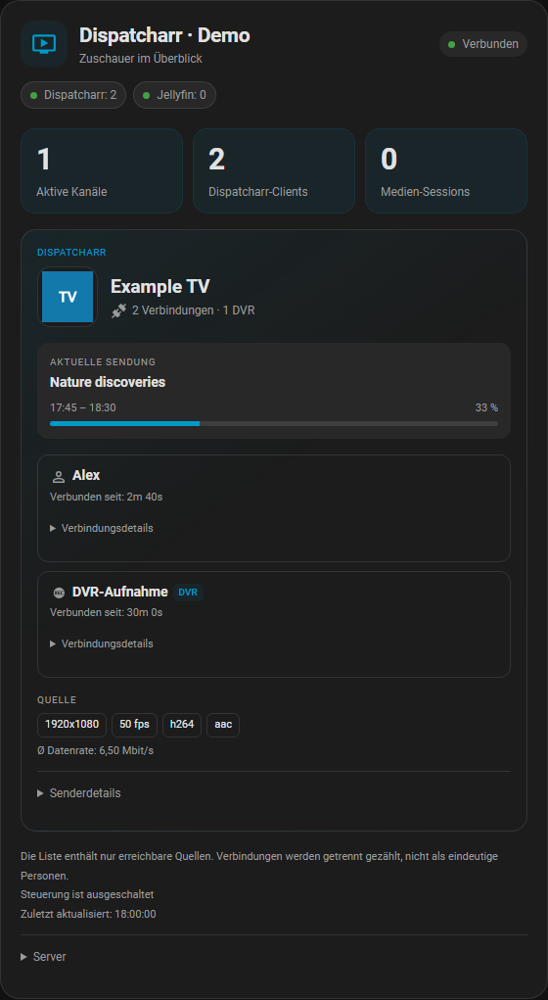

# Einrichtung mit Bildern

[English](setup.md) | **Deutsch** · [Zur deutschen Hauptanleitung](README.de.md)

**Zuerst Dispatcharr verbinden, danach optionale Medienserver hinzufügen und dann
die Karte ins Dashboard setzen.** Die Keys für Jellyfin, Emby und Plex kommen
nach der ersten Dispatcharr-Einrichtung in die Integrationsoptionen. Alle Schritte
funktionieren über die Oberfläche.

Die Bilder der Einrichtungsdialoge zeigen Home Assistant **2026.9.4** mit Integration
**0.2.0** in einer vorübergehenden Testinstanz. Serveradresse und Wiedergabedaten
sind Beispiele; alle Schlüsselfelder sind leer. Deine eigenen Server-URLs verwenden.
Je nach HA-Version, Sprache und Theme können Beschriftung und Anordnung abweichen.

- [Dispatcharr verbinden](#1-dispatcharr-verbinden)
- [Medienserver-Optionen finden](#2-konfigurieren-öffnen)
- [Jellyfin-, Emby- oder Plex-Zugangsdaten eintragen](#3-medienserver-hinzufügen)
- [Dashboard-Karte finden und hinzufügen](#4-dashboard-karte-hinzufügen)
- [Fehlendes HACS-Logo](#warum-fehlt-das-logo-in-hacs)

## 1. Dispatcharr verbinden

Zuerst die [Installation mit HACS](README.de.md#installation-mit-hacs) einschließlich
Home-Assistant-Neustart abschließen. Danach **Einstellungen → Geräte & Dienste →
Integration hinzufügen → Dispatcharr** öffnen. Auf der Dispatcharr-Integrationsseite
heißt die entsprechende Schaltfläche **Dienst hinzufügen**.

Die **Dispatcharr-URL** und den **API-Key eines Dispatcharr-Administrators** eintragen
und mit **OK** bestätigen. Siehe [Dispatcharr-Berechtigungen](README.de.md#api-key-und-berechtigungen).
In dieses erste Fenster gehört kein Jellyfin-, Emby- oder Plex-Key. In Version
0.2.0 wird zuerst eine Dispatcharr-Verbindung benötigt; anschließend lassen sich
die optionalen Medienserver hinzufügen.

## 2. Konfigurieren öffnen

**Einstellungen → Geräte & Dienste → Dispatcharr** öffnen. Unter **Dienste** bei
der eingerichteten Instanz auf das **Zahnrad (Konfigurieren)** klicken. Bei mehreren
Dispatcharr-Instanzen diejenige auswählen, deren Karte die Medienserver zeigen soll.

Dann **Medienserver** auswählen:

## 3. Medienserver hinzufügen

**Server hinzufügen** auswählen:

Hier wird der zusätzliche API-Key beziehungsweise Token eingetragen:

| Feld | Eingabe |
| --- | --- |
| Servertyp | `jellyfin`, `emby` oder `plex` |
| Anzeigename | Optionaler Name, um diesen Server in der Karte zu erkennen |
| Server-URL | HTTP(S)-Adresse dieses Servers, von Home Assistant aus erreichbar |
| API-Key / Plex-Eigentümer-Token | Zugangsdaten dieses Servers, siehe unten |
| Beenden auf diesem Server erlauben | Optional; für reine Anzeige ausgeschaltet lassen |

| Server | Zugangsdaten |
| --- | --- |
| Jellyfin | Administrator-API-Key aus dem Jellyfin-Server-Dashboard |
| Emby | Administrator-API-Key aus dem Emby-Server-Dashboard |
| Plex | **X-Plex-Token** des Eigentümers eines mit diesem Konto verknüpften Servers |

Ein Plex-*Claim-Token* ist kein API-Token. Plex erklärt in seiner
[offiziellen Anleitung, wie man den Eigentümer-Token findet](https://support.plex.tv/articles/204059436-finding-an-authentication-token-x-plex-token/).
Keys gehören nicht in die Dashboard-Konfiguration, Screenshots oder GitHub-Issues.

Mit **OK** speichern. Die Integration prüft den Server und den Zugriff auf dessen
Sessions. Für jeden weiteren Server **Medienserver → Server hinzufügen** wiederholen.
Dispatcharr, Jellyfin, Emby und Plex können gleichzeitig laufen, auch mit mehreren
Servern desselben Typs. Für diese Karte ist keine zusätzliche HA-Integration je
Medienserver-Typ nötig.

Gespeicherte Keys und URLs lassen sich unter **Medienserver → Server bearbeiten
oder entfernen** ändern. Beim Bearbeiten bleibt der bisherige Key erhalten,
wenn das Schlüsselfeld leer bleibt.

Zum Beenden von Sessions muss zusätzlich der globale Schalter **Steuerung aktivieren**
eingeschaltet sein. Die Aktion benötigt HA-Administratorrechte und Unterstützung
durch Server und Player; siehe [bekannte Grenzen](media-servers.de.md#bekannte-grenzen).

## 4. Dashboard-Karte hinzufügen

Die Installation stellt die Karte bereit; du wählst aus, wo sie erscheinen soll.

1. Ein bearbeitbares Dashboard öffnen und auf den **Stift (Dashboard bearbeiten)** klicken.
2. **Karte hinzufügen** wählen. In einem Dashboard mit Abschnitten auf das **+**
   innerhalb des gewünschten Abschnitts klicken.
3. Oben im Dialog auf **Nach Karte** wechseln. Die zuerst angezeigte Registerkarte
   **Nach Entität** schlägt Standardkarten für einzelne Sensoren vor. Auch
   **Alle Karten durchstöbern** führt zur Kartenauswahl.
4. Nach **Dispatcharr** suchen und die Community-Karte **Dispatcharr** auswählen.

5. Im visuellen Editor unter **Zuschauer-Sensor** den Sensor **Zuschauer** deiner
   Dispatcharr-Instanz auswählen (bei englischer Ersteinrichtung gegebenenfalls
   **Viewers**, wie im Bild). Eine bereits passende Vorauswahl beibehalten.
6. Optional Titel, Kartensprache, kompakte Ansicht und sichtbare Aktionsschaltflächen einstellen.
7. **Speichern** und anschließend **Fertig** wählen.

Die Karte übernimmt die in Schritt 3 hinzugefügten Medienserver automatisch. Eine
zweite Karteninstallation, zusätzliche JavaScript-Ressource oder YAML ist nicht
nötig. Ohne aktive Sessions erscheint **Niemand schaut gerade**. Die Integration
startet für die Vorschau keine Wiedergabe.

### Gruppierte Sender (nächstes Release)

Diese Ansicht ist auf `main` für das nächste Release enthalten. Das veröffentlichte
Release **0.2.0** zeigt weiterhin einzelne Client-Karten. In der neuen Ansicht
erscheint jeder Dispatcharr-Sender einmal mit Logo, Sendung und
Quellqualität. Darunter stehen alle **Verbindungen** mit Name beziehungsweise
Alias und eigener Verbindungsdauer. Zwei Clients auf demselben Sender bedeuten
also **1 aktiver Kanal, 2 Dispatcharr-Clients**, auch mit einem DVR-Client.
Die Zähler erfassen Verbindungen und keine eindeutigen Personen.

Unter **Verbindungsdetails** bleiben die ursprüngliche Gerätebeschreibung,
Benutzer-/Client-ID, der gemeldete Wiedergabestatus und das jeweilige Ausgabeprofil
mit Format sichtbar. **Session beenden** betrifft weiterhin nur diese Verbindung.
**Kanal für alle beenden** steht getrennt unter **Senderdetails** und verlangt eine
Bestätigung, die ausdrücklich auch auf DVR-Aufnahmen hinweist.

Die DVR-Kennzeichnung erkennt Dispatcharrs gemeldeten Client-Marker
`Dispatcharr-DVR/recording-<id>`. Sie bestätigt keine Aufnahmedatei und leitet daraus
keine menschliche Identität ab. Gruppiert wird über die Kanal-UUID innerhalb der
gewählten Instanz. Gleiche Namen führen weder Sender noch Nutzer oder Sessions
von Jellyfin, Emby und Plex zusammen.

Ein Sender mit Zuschauer und DVR-Verbindung (frei erfundene Beispieldaten)

Vorschau mit allen vier Quellen (frei erfundene Beispieldaten)

Fehlt **Dispatcharr** unter **Nach Karte**, zuerst die Integration fertig einrichten,
dann die Browserseite vollständig neu laden beziehungsweise die Companion-App neu
öffnen. Nach Installation oder Update muss auch Home Assistant neu gestartet worden
sein. Bei einem Konfigurationsfehler einer vorhandenen Karte zuerst die Oberfläche
neu laden, bevor du die Karte entfernst oder neu erstellst.

## Warum fehlt das Logo in HACS?

**Geprüft am 6. Oktober 2026 mit HACS 2.0.5:** Die Repository-Liste kann
**icon not available** anzeigen, obwohl die Integration richtig installiert ist.
Das Logo wird mitgeliefert und von Home Assistant in den eigenen Integrationsansichten
korrekt ausgeliefert. HACS fragt für diese Liste noch die ältere externe Logo-Adresse
ab. Das wird in [HACS-Issue #5171](https://github.com/hacs/integration/issues/5171)
verfolgt. Die [HA-Dokumentation zu lokalen Logos](https://developers.home-assistant.io/blog/2026/02/24/brands-proxy-api/)
beschreibt den von dieser Integration verwendeten Mechanismus.

Dispatcharr neu zu installieren behebt diesen HACS-Anzeigefehler nicht. Einrichtung,
Session-Anzeige und Dashboard-Karte funktionieren trotzdem. Ein fehlendes
**Senderlogo oder Medienposter innerhalb der Karte** ist ein anderer Fall: Dieses
Bild stammt vom jeweiligen Quellserver und ist dort möglicherweise nicht verfügbar.
