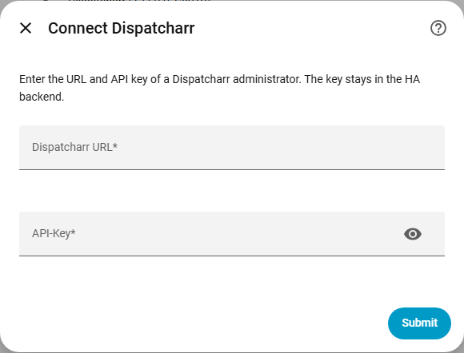
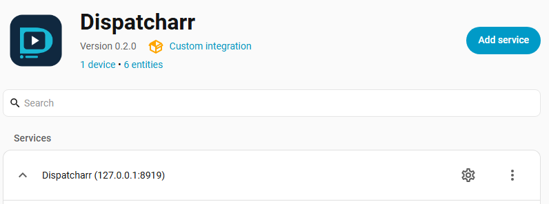
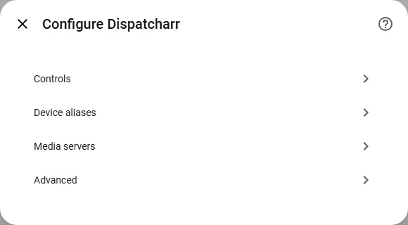
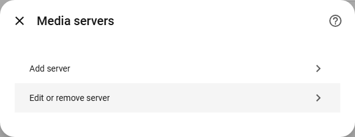
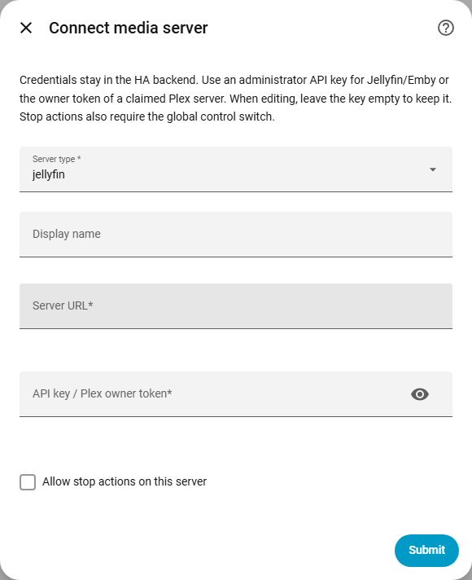
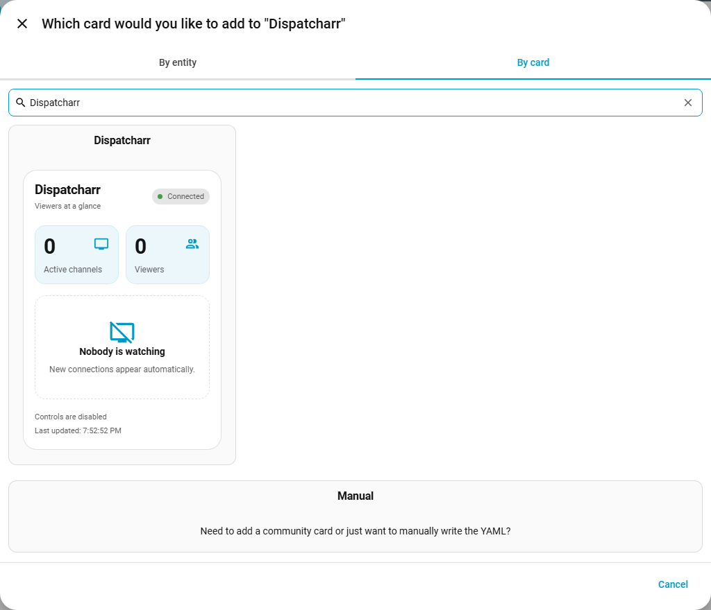
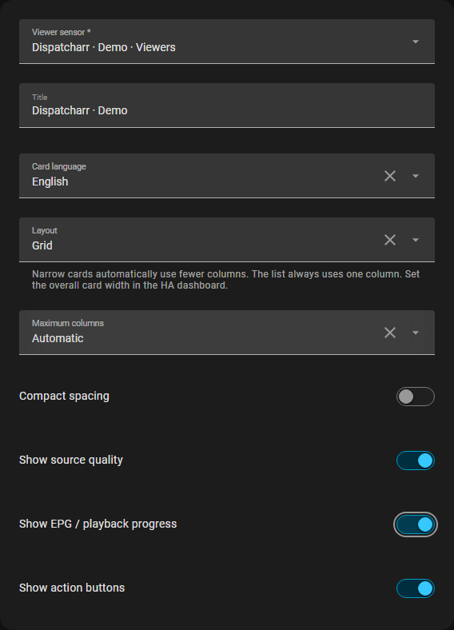
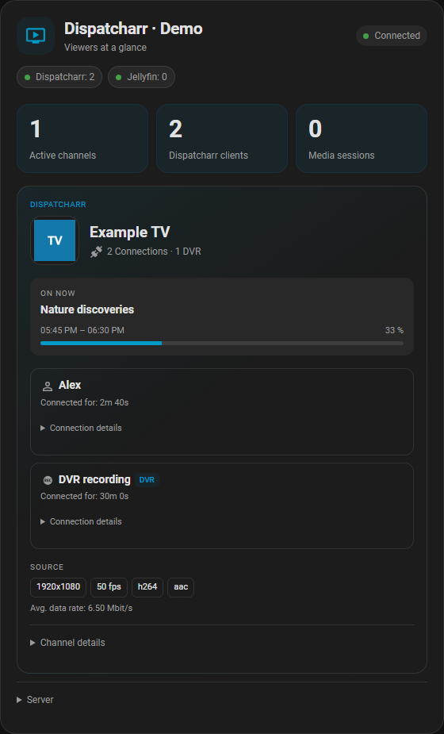

# Setup with screenshots

**English** | [Deutsch](setup.de.md) · [Back to the README](../README.md)

**First connect Dispatcharr, then add optional media servers, then add the card to
your dashboard.** Jellyfin, Emby and Plex keys go in the integration's options
after the initial Dispatcharr setup. Everything below works through the GUI.

The setup-form screenshots show Home Assistant **2026.9.4** running integration
**0.2.0** in a disposable test instance. The example server address and playback
data are synthetic; all credential fields are empty. Use your own server URLs.
Menu wording and layout can differ with your HA version, language and theme.
The card-editor screenshot is updated for **0.3.0** in the real HA frontend with
synthetic state; the unchanged connection forms retain their original captures.

- [Connect Dispatcharr](#1-connect-dispatcharr)
- [Find the media-server options](#2-open-configure)
- [Enter Jellyfin, Emby or Plex credentials](#3-add-a-media-server)
- [Find and add the dashboard card](#4-add-the-dashboard-card)
- [Missing HACS logo](#why-is-the-logo-missing-in-hacs)

## 1. Connect Dispatcharr

Follow [Install with HACS](../README.md#install-with-hacs), including the Home
Assistant restart. Then open **Settings → Devices & services → Add integration →
Dispatcharr**. On the Dispatcharr integration page, the equivalent button is
**Add service**.

Enter the **Dispatcharr URL** and the **Dispatcharr administrator's API key**, then
select **Submit**. See [Dispatcharr key permissions](../README.md#api-key-and-permissions).
This first form does not accept a Jellyfin, Emby or Plex key. Version 0.2.0 requires
a Dispatcharr connection before optional media servers can be added.

## 2. Open Configure

Go to **Settings → Devices & services → Dispatcharr**. In **Services**, find the
instance you just added and click its **gear icon (Configure)**. With multiple
Dispatcharr instances, choose the one whose card should show the media servers.

Choose **Media servers**:

## 3. Add a media server

Choose **Add server**:

This is where the additional API key or token goes:

| Field | What to enter |
| --- | --- |
| Server type | `jellyfin`, `emby` or `plex` |
| Display name | Optional name to identify this server in the card |
| Server URL | That server's HTTP(S) address, reachable from Home Assistant |
| API key / Plex owner token | That server's credential, as explained below |
| Allow stop actions on this server | Optional; leave off for monitoring only |

| Server | Credential |
| --- | --- |
| Jellyfin | An administrator API key created in Jellyfin's server dashboard |
| Emby | An administrator API key created in Emby's server dashboard |
| Plex | The owner's **X-Plex-Token** for a server linked to that account |

A Plex *claim token* is not an API token. Plex documents how to
[find the owner's authentication token](https://support.plex.tv/articles/204059436-finding-an-authentication-token-x-plex-token/).
Keep keys out of dashboard configuration, screenshots and GitHub issues.

Select **Submit**. The integration checks the server and access to its session
data before saving. Repeat **Media servers → Add server** for each additional
server. Dispatcharr, Jellyfin, Emby and Plex can all work at the same time,
including multiple servers of the same type. A separate HA integration for each
media-server type is not needed for this card.

To change a saved key or URL, use **Media servers → Edit or remove server**.
Leaving the key field empty while editing keeps the existing key.

To enable session termination, also enable the integration's global **Enable
controls** switch. Actions require an HA administrator and client/server support;
see [control limits](media-servers.md#controls-and-current-limits).

## 4. Add the dashboard card

Installing the integration makes the card available; you choose where to place it.

1. Open an editable dashboard and click the **pencil (Edit dashboard)**.
2. Choose **Add card**. In a sections dashboard, use the **+** inside the desired
   section.
3. Select the **By card** tab at the top of the dialog. The initial **By entity**
   tab suggests standard cards for individual sensors. **Browse all cards** also
   takes you to the card list.
4. Search for **Dispatcharr**, then select the **Dispatcharr** community card.

5. In the visual editor, select your Dispatcharr instance's **Viewer sensor**
   (the sensor named **Viewers**). If it is already selected correctly, keep it.
6. Choose **Layout** (Grid, Compact list or Logo tiles), maximum columns, spacing,
   quality/progress visibility, title, card language and action buttons as needed.
7. Select **Save**, then **Done** to leave dashboard editing.

See [all three layouts with desktop and phone screenshots](card-layouts.md).

The card automatically includes media servers configured in step 3. No second
card installation, extra JavaScript resource or YAML is needed. With no active
sessions it shows **Nobody is watching**; it does not start playback for a preview.

### Grouped channels (0.2.1 and later)

Update to the latest release in HACS, restart Home Assistant and reload the dashboard.
Each Dispatcharr channel appears once, with its logo,
programme and source quality. Its **Connections** list retains every client,
name or alias and individual connection duration. Two clients on the same channel
therefore mean **1 active channel, 2 Dispatcharr clients**, including a DVR client.
These counts describe connections, not unique people.

**Connection details** show the original device description, user/client IDs,
reported playback state and client-specific output profile/format. **End session**
still targets only that connection. The separate **Stop channel for everyone**
action is in **Channel details** and requires confirmation, including a DVR warning.

The DVR badge recognizes Dispatcharr's reported `Dispatcharr-DVR/recording-<id>`
client marker; it does not verify a recording file or infer a human viewer.
Grouping uses channel UUIDs within the selected instance. Matching names alone
never combine channels, users or sessions from Jellyfin, Emby and Plex.

One channel with a viewer and DVR connection (fictional demo data)

Preview with all four sources (fictional demo data)

If **Dispatcharr** is missing from **By card**, first finish the integration setup,
then fully reload the browser page or reopen the companion app. After an
installation/update, also make sure you restarted Home Assistant. For an existing
card's configuration error, reload the frontend before removing or recreating it.

## Why is the logo missing in HACS?

**Verified on 6 October 2026 with HACS 2.0.5:** its repository list can show
**icon not available**, even though the integration is installed correctly.
The integration bundles its logo; Home Assistant serves it correctly in its own
integration screens. HACS still requests the older remote brand address for this
list. This is tracked in [HACS issue #5171](https://github.com/hacs/integration/issues/5171).
Home Assistant's [local branding documentation](https://developers.home-assistant.io/blog/2026/02/24/brands-proxy-api/)
explains the supported mechanism used by this integration.

Reinstalling Dispatcharr does not fix that HACS display issue. It does not affect
setup, session monitoring or the dashboard card. A missing **channel logo or media
poster inside the card** is a different issue: that image comes from its source
server and may simply be unavailable.
