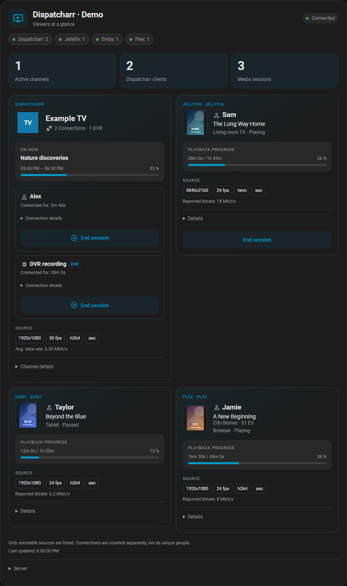
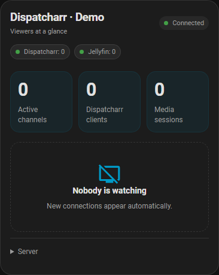
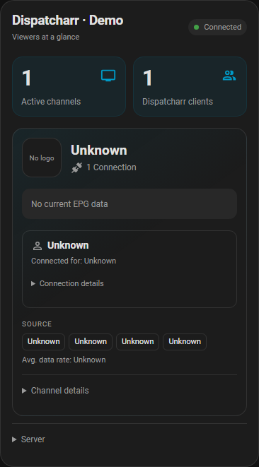
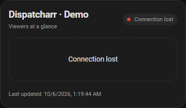

# Validation report

**English** | [Deutsch: initial validation](validation.de.md)

Verified on 6 October 2026 with **Home Assistant 2026.9.4** and
**Dispatcharr 0.31.0**. This does not imply compatibility with untested versions.

## 0.2.0 media-server release

**84 backend tests** passed in the official HA 2026.9.4 image on Unraid, plus Ruff
and the expanded Chromium card suite. See the detailed [media-server validation
record](beta-validation.md) for real media-server versions, concurrent playback,
the successful exact Jellyfin stop, and Emby/Plex control limitations.

## Production verification

### Grouped-channel preview and owner acceptance

On 6 October 2026, the new card was loaded through a response override in a
separate browser context against the real HA 2026.9.4 frontend and the existing
Dispatcharr 0.31.0 integration. The existing one-channel/two-client case, including
one reported DVR client, rendered as one channel block with two individual rows.
Desktop and mobile checks passed. Installed files, dashboards and playback were
not changed; no real session was stopped.

After that read-only preview, the owner requested installation of the same card.
Only the JavaScript file and its existing Lovelace resource version URL were
updated, with a private backup of the original file and dashboard configuration.
The installed file's hash matched the tested commit. A fresh browser confirmed
the served module and layout on desktop and mobile without a response override
or JavaScript errors. Dashboard configuration, Dispatcharr and Jellyfin settings,
controls and playback were preserved; HA did not need a restart. The owner then
approved promotion to `main`. This is layout acceptance, not a new live stop test
or independent source-code review. No new release was published for this preview.

The isolated Chromium suite covers two and fifteen clients sharing a UUID,
distinct UUIDs with identical channel names, identical client IDs across different
channels, reported DVR identity, per-client output fields, exact-client versus
whole-channel controls, preservation of expanded details after polling, missing
IDs/metadata, administrator gating and concurrent independent media sources.
The public `grouped-channel-en.png` and `grouped-channel-de.png` screenshots use
fictional fixture data in the native HA frontend; the read-only live evidence is
kept private. Light and dark themes were checked.

### 0.1.3 resource loading fix

The owner's existing Brave session showed `Custom element doesn't exist:
dispatcharr-card`, with no card registration or resource request. Fresh Chromium
sessions worked on both the local and HTTPS addresses. Adding the versioned module
to Lovelace resources and performing a normal reload repaired that same Brave
session; the owner separately confirmed recovery in the companion app. No viewing
session was stopped. The integration now performs this registration automatically.

The backend suite passed **65 tests** in the official HA 2026.9.4 image on Unraid.
New tests use HA's real resource collection for initial registration, concurrent
instances, reload, persisted-resource upgrade, duplicate removal, preservation of
unrelated URLs and YAML mode. Ruff and the bilingual Chromium card suite passed.

The installed versions, API permissions and HACS were checked in the actual
environment. A valid API key was accepted and an intentionally invalid key was
rejected with HTTP 401. Status, actual user IDs, targeted channel metadata,
current EPG, provider/profile directories and harmless stop-endpoint `OPTIONS`
requests were checked against the official API contract.

Version 0.1.0 was installed through the real HACS UI. HA configuration validation
passed before restarting. The integration was configured with URL and API key
through the GUI. A new dashboard view was added after backing up the existing
dashboard; its existing views were preserved. Controls were initially disabled.

The empty state and then an active viewer were verified on desktop and mobile.
The active viewer's name came from the actual Dispatcharr user ID. Current EPG,
source resolution, frame rate, codecs and average bitrate were present. No
JavaScript errors occurred. The agent did not start extra IPTV playback or
terminate a real session. Stop scenarios in the automated suite use synthetic data.

The repository owner separately confirmed on 6 October 2026 that they successfully
ended **one real IPTV client session** manually. This is an owner-reported
functional test, not a claim of independent human source-code review.
Preservation of a second viewer on the same channel and the separate whole-channel
stop are covered by synthetic tests; their live verification has not been confirmed.

Version 0.1.2 was then updated through HACS and verified after restart: installed
file hashes, the local brand-image endpoint, English HACS README, German guide
link and both language choices in the installed visual editor. The existing
control-switch setting was preserved. No JavaScript errors occurred.

## Initial 0.1.0 backend checks

**60 tests passed** using actual HA classes from the official
`ghcr.io/home-assistant/home-assistant:2026.9.4` container with a synthetic API.

| Scenario | Verified behavior |
| --- | --- |
| Two viewers on one channel | One channel, two clients, actual user-ID mapping |
| More than ten clients | Truncated overview detected and full details fetched |
| Individual stop | Exact ID; other viewer remains; no channel-stop fallback |
| Whole-channel stop | Separate action requiring explicit confirmation |
| Expired IDs or misleading success | Preflight and post-action checks, clear errors |
| Disabled controls or non-admin HA user | Rejected before a write request |
| Invalid key, HTTP 403, outage | Setup and runtime errors handled |
| Reconnection | Coordinator restores data and availability |
| Missing user, metadata or EPG | Unknown values, no fabricated identities |
| Metadata and EPG caches | Separate intervals, targeted UUIDs, bounded retries |
| URLs and pagination | Credential URLs and cross-origin redirects rejected |
| Secrets in responses | Excluded from entities and diagnostics |
| Stable IDs | Coordinator reload and renamed timestamp entity references |
| Configuration | URL/key only, options, aliases and interval bounds |

Ruff, Python formatting, JavaScript syntax, hassfest and HACS validation are part
of GitHub Actions. From 0.1.2, brand assets are bundled and the HACS action has no
ignored checks.

```sh
docker run --rm --entrypoint /bin/sh \
  -v "$PWD:/work" -w /work \
  ghcr.io/home-assistant/home-assistant:2026.9.4 \
  -c 'pip install -r requirements-test.txt && python -m pytest -q && ruff check custom_components tests && ruff format --check custom_components tests'
node --check custom_components/dispatcharr/www/dispatcharr-card.js
```

On Windows, use an absolute Docker Desktop bind mount. An upstream aiohttp/HA
inheritance warning is not a failed integration test.

## Frontend checks

The original full frontend tests used a disposable HA instance in Docker
Desktop, published only on loopback. The synthetic API in
[`tests/support/fake_dispatcharr.py`](../tests/support/fake_dispatcharr.py)
does not start IPTV playback. Verified through real Chromium rendering:

- Light/dark themes, desktop and 390-pixel mobile viewport.
- Two clients on one channel, then 15 clients and separate channel/viewer counts.
- Cancel a stop confirmation and preserve both sessions.
- Stop only `client_0`; `client_1` remains visible.
- Separately confirm stopping the whole synthetic channel.
- Missing EPG/logos/quality, outage and recovery, last-success after reload.
- GUI aliases, visual title editor, HA restart and integration reload.
- Twelve fresh browser contexts with the visual editor, checking startup races.
- No Dispatcharr keys or direct Dispatcharr requests in browser URLs.

The module waits for HA's application element before defining custom elements.
The HA form controls are loaded before opening the visual editor. The upstream
registry race is described in [frontend issue #52960](https://github.com/home-assistant/frontend/issues/52960).

Version 0.1.2 adds a credential-free synthetic Chromium regression suite for
English/German/automatic language selection, unsupported-language fallback,
translated IDs and confirmations, exact-client service payloads, missing data,
outage/recovery, and mobile versus wide two-column layouts. It runs in CI:

```sh
pip install playwright
python -m playwright install chromium
python tests/card_browser.py
```

Its service and image functions are local stubs; they cannot stop a real session.
The redesigned visual editor is additionally exercised against the real HA
frontend, with changes cancelled, and synthetic screenshots use isolated card
data with stubbed actions. No test container is needed for this card-only check.

The optional `tests/browser_smoke.py` checks a disposable local HA dashboard:

```sh
python tests/browser_smoke.py --storage-state .local/browser-storage.json
```

It requires a private test login and a dashboard with two synthetic viewers.
Never commit the storage-state file. This small smoke test alone does not cover
all full-stack stop and outage scenarios listed above.

### Selectable layouts (0.3.0)

`tests/card_layouts.py`, called by the Chromium suite, verifies every layout with
multiple channel UUIDs, duplicate names/IDs across sources, DVR, 15 clients,
missing metadata, partial outages and exact-client/whole-channel/media actions.
It checks automatic and explicit column limits at 390, 860 and 1320 pixels,
overflow, visibility switches, detail persistence, translations and legacy
configuration compatibility. Service calls remain local synthetic stubs.

The candidate module was also loaded in an isolated browser context against the
real HA 2026.9.4 frontend. Actual native select menus and switches changed the
layout, columns, spacing, quality and progress settings successfully; serialized
configuration restored those selections. This check used synthetic state and
stubbed actions, made no dashboard/server configuration writes and sent no live
stop requests. No additional containers were created for this feature.

## Screenshots

All public screenshots contain synthetic users, programmes, logos and source
measurements. They are not real customer or provider data.
The current previews show the selectable card layouts included in 0.3.0,
rendered inside the actual HA frontend with synthetic fixture state and stubbed
image and service calls. Desktop and mobile layouts in English and German show
a viewer and a reported DVR connection on one channel, alongside all three media
server types. The empty, offline and missing-data previews are refreshed too.
Setup-form screenshots were captured on 0.2.0; those forms did not change.
The English/German card-editor screenshots were refreshed for 0.3.0 using native
HA controls and synthetic entity state. The [layout guide](card-layouts.md) includes
all three layouts at desktop and phone sizes. The shared source data,
capture checks and offline renderer are in `scripts/render_screenshots.py`.






## Test infrastructure

Temporary Unraid containers, test directory and downloaded HA image were removed.
Docker Desktop containers and the temporary HA image were also removed after the
initial test cycle. No permanently running test service is required.
